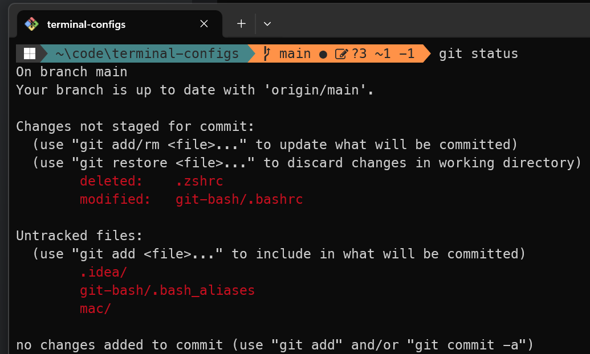
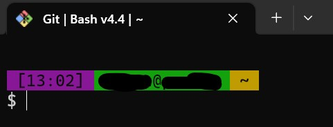

# Terminal configs for Win/Mac/Linux

## Windows (oh-my-posh):
- Install `oh-my-posh` (choco did not work, use `manual`)
- Install fonts (e.g. Meslo)
- Put `.bashrc` and `.bash_aliases` in $HOME
- Put `Microsoft.PowerShell_profile.ps1` in: `C:\Users\<user>\Documents\PowerShell` for PowerShell 7 and into `C:\Users\<user>\Documents\WindowsPowerShell` for PowerShell 5
- Use `settigs.json` to setup windows terminal (Ctrl+Shift+,) and full replace.  

Click me for screenshot with example

### Windows terminal + git bash

  
## git-prompt.sh

- Put `git-prompt.sh` in  `C:\Program Files\Git\etc\profile.d\git-prompt.sh`   
Note: does not work with `oh-my-posh`, old terminal prompt 

Click me for screenshot with example

### Windows terminal + git bash

